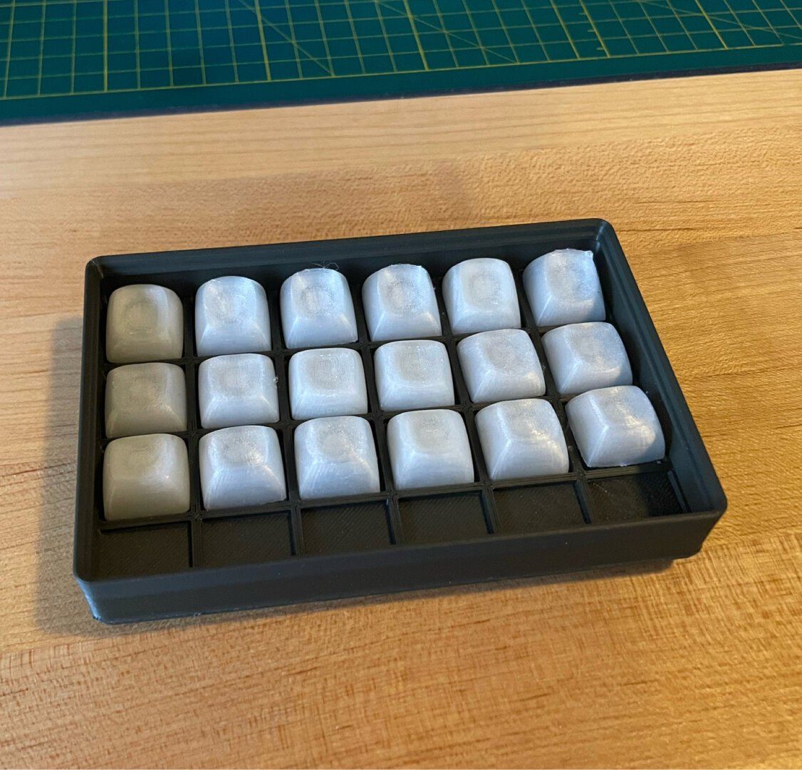

# Keycap Tray

An OpenSCAD implementation of a tray to keep your keycaps in. The tray is
organized into a grid, where the number of rows and columns are parameters. Uses
[Vector76's Gridfinity library][vector76-lib] to render the tray inside an
appropriately sized Gridfinity container.

Consider giving this project a like on Printables, and sharing your make there
if you build it.

## Prerendered STLs

### 3x5

#### Flat

[STL](./KeycapTray_Flat_3x5.stl)

#### Gridfinity

[STL](./KeycapTray_Gridfinity_3x5.stl)

### 4x6

#### Flat

[STL](./KeycapTray_Flat_4x6.stl)

#### Gridfinity

[STL](./KeycapTray_Gridfinity_4x6.stl)

### 5x5

#### Flat

[STL](./KeycapTray_Flat_5x5.stl)

#### Gridfinity

[STL](./KeycapTray_Gridfinity_5x5.stl)

[vector76-lib]: https://github.com/vector76/gridfinity_openscad
